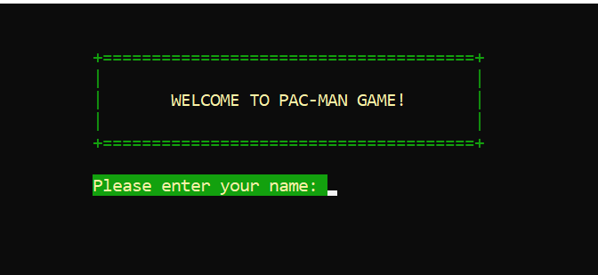
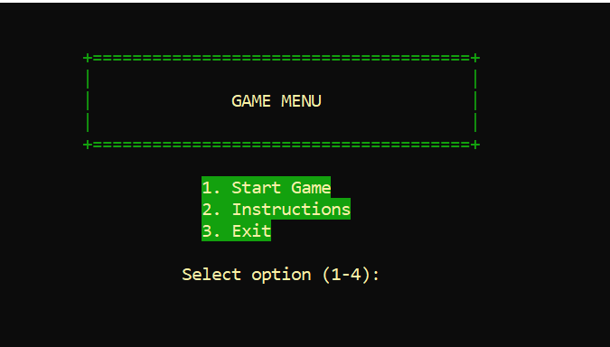
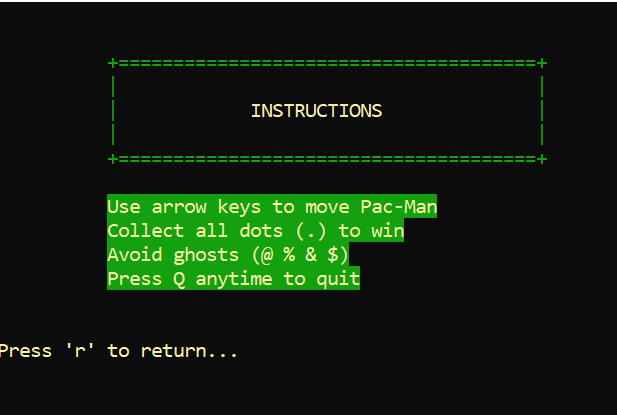
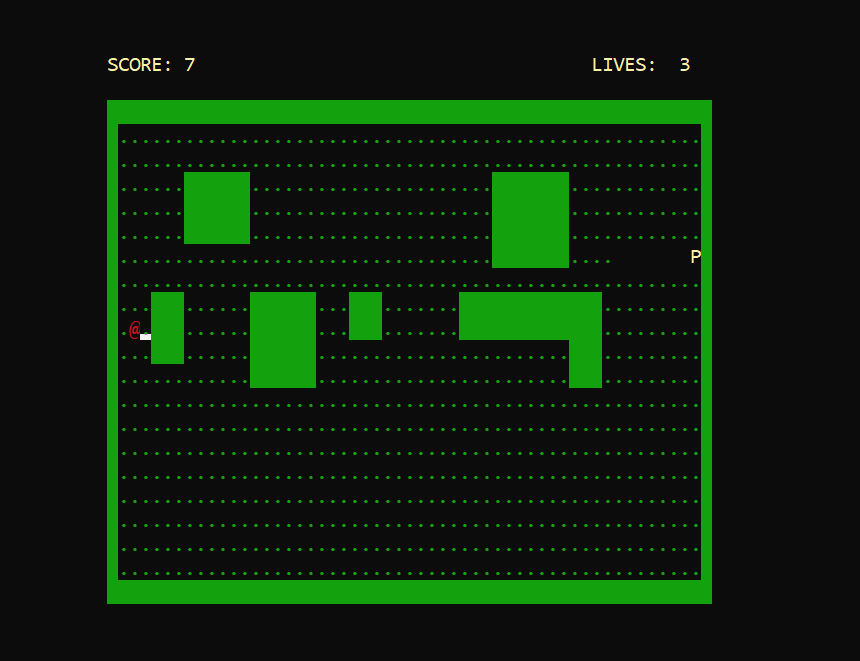
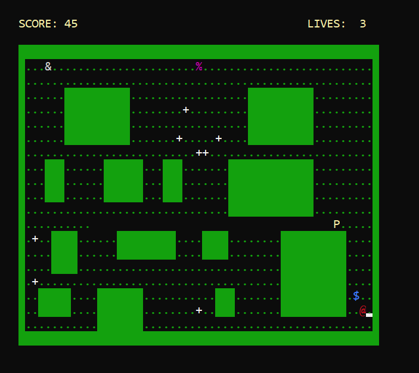
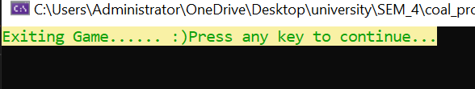
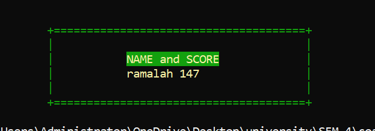

# 👾 Pac-Man Game – x86 Assembly (MASM)
- A retro-style Pac-Man game built using x86 Assembly Language and the Irvine32 library. This project was created as part of a low-level programming course to explore graphics, user input handling, and game logic using assembly.

# How to Play
- Use Arrow Keys to move Pac-Man in all 4 directions
- Collect dots (·) to gain points
- Avoid ghosts (@(RED),$(blue),%(pinky),&(clyde)) — collision costs a life
- You have 3 lives total
- The game ends when all lives are lost or all dots are eaten
- or when you pres q for quit

# 🎮 Features
- Smooth directional movement using arrow keys
- Collectible dots and score tracking
- Wall collision handling
- Game-over conditions
- Classic console-based gameplay visuals

# 🧠 Technologies Used
- x86 Assembly (MASM)
- Irvine32 Library

# 🛠️ How to Run
- Install Visual Studio with MASM
- Make sure Irvine32 library is set up properly
- Open the .asm file in your IDE
- Build and run the program

## 📸 Screenshots

### 🟡 Welcome Screen

### 📋 Main Menu

### 📖 Instructions

### 🎮 Level 1

### ⚠️ Level 2 – First Ghost Appears

### 💀 Level 3 – Increased Difficulty

### 🏁 Exit Screen

### 🧾 Score Display

# 🧩 Challenges Faced
- Managing continuous movement with limited key input handling
- Handling screen redraws manually in the console
- Implementing collision detection and movement logic without high-level structures

# ✨ What I Learned
- Low-level memory operations and registers
- Working with interrupts and keypress handling
- Game logic structuring in assembly language

# 🙌 Credits
- Built as part of coursework at FAST NUCES
- Used Irvine32 library for I/O and display routines

